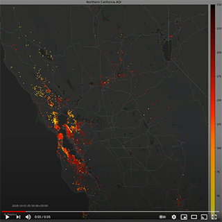

# pa-map

## Overview
When used together this set of modules gets PurpleAir PA-II sensor historical data for sensors located within a bounding box for a given date range, plots the data on a map and generates a timelapse video of the readings.

Some of the modules may also be used independently as modules in other programs or directly from the command line.

## Files
1. pa_map_vis.py: The main program that executes the other modules to get the data and make the timelapse video.
2. pa_get_df.py: Gets historical sensor data and returns a Pandas data frame.
3. pa_map_plot.py: create the image frames. 
4. get_map.py: Gets a map image for the provided bounding box from Mapbox. 
5. pa_map_vid.py: create h.264 encoded mp4 video from image frames.

## Installation and Use
1. Create a folder on your computer and clone the repo into it ( git clone https://github.com/wawzat/pa-map.git )  
2. It is recommended to create a virtual environment with virtualenv (or conda if you are using Anaconda or miniconda)  
3. Run python -m pip install -r requirements.txt to install the required Python packages.  
4. Request a key for the PurpleAir REST API from api@purpleair.com.
5. Register an account with https://www.mapbox.com.
6. Create a root folder path and subfolders for images, data and video.
7. Rename the config_template.py file to config.py.
8. Edit config.py with the PurpleAir keys, Mapbox tokens and file directory paths listed in the config.py template.
9. Run python pa_map_vis.py -h for help with the command line arguments.

## Notes:
1. Data are obtained in three stages.
    1. A sensor request is sent to the PurpleAir API and a list of the sensors installed within the provied bounding box is retrieved.
    2. The list of sensors is iterated over and metadata is retrieved from the PurpleAir API for each sensor.
    3. The list of sensors is iterated over again and historical data is retrived from the ThingSpeak API for each sensor.
2. There are two data retrieval modes that may be selected with the -d argument. 
    1. -d TS obtains historical data from ThinkSpeak. Historical data are saved in the Data folder as csv files.
    2. -d CSV provides a list the of csv files that exist in the Data folder to choose from. The intent here is if you want to adjust to a shorter date range, or modify some of the plotting/video parameters you can recreate the time lapse without re-downloading the historical data.
3. The metadata obtained during step 1.2 above are saved as .txt files in the metadata folder. The --md argument will allow you to choose to use one of these files in-lieu of obtaining it from the PurpleAir API.
4. If you are experiencing errors due to API rate limiting you may try increasing the sleep() time in pa_get_df.py get_sensor_ids() or get_ts_data() functions for PurpleAir or ThingSpeak respectively.
5. Regions with a large number of sensors may take several hours to complete collecting the data.

## Required Non-Standard Python Libraries
- colorcet
- matplotlib
- numpy (should install automatically with Pandas)
- opencv-python (cv2)
- pandas
- Pillow (PIL) (should install automatically with matplotlib)
- requests 